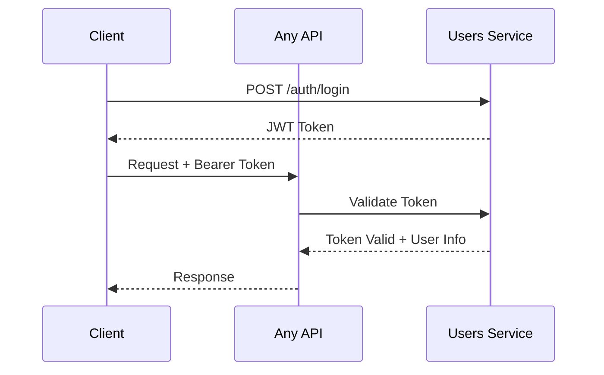

# 📋 Contratos de API

Esta sección documenta los contratos de las APIs de los diferentes servicios backend de Melodia. Utilizamos especificaciones OpenAPI para documentar nuestras APIs de manera estándar.

!!! info "Documentación Interactiva"
    Cada servicio incluye una interfaz Swagger UI interactiva que permite explorar y probar los endpoints directamente desde esta documentación.

---

## Songs Service API

El Songs Service maneja toda la lógica relacionada con canciones, álbumes, playlists y colecciones.

**Base URL**: `https://songs-service-xxxxx.run.app/api/v1`

<!-- TODO: Reemplazar con URL real del servicio -->

### Especificación OpenAPI

<!-- TODO: Agregar archivo OpenAPI en docs/openapi/songs-service.yaml -->

```swagger-ui
https://melodia-fiuba.github.io/docs/openapi/songs-service.yaml
```

!!! warning "Placeholder"
    La especificación OpenAPI del Songs Service será embebida aquí una vez que esté disponible en `docs/openapi/songs-service.yaml`.

### Endpoints Principales

| Método | Endpoint | Descripción |
|--------|----------|-------------|
| GET | `/songs` | Listar canciones |
| POST | `/songs` | Crear nueva canción |
| GET | `/songs/{id}` | Obtener canción por ID |
| PUT | `/songs/{id}` | Actualizar canción |
| DELETE | `/songs/{id}` | Eliminar canción |
| GET | `/playlists` | Listar playlists |
| POST | `/playlists` | Crear playlist |
| GET | `/artists/{id}/songs` | Canciones de un artista |

<!-- TODO: Completar con todos los endpoints disponibles -->

---

## Users Service API

El Users Service maneja autenticación, autorización y gestión de usuarios.

**Base URL**: `https://users-service-xxxxx.run.app/api/v1`

<!-- TODO: Reemplazar con URL real del servicio -->

### Especificación OpenAPI

<!-- TODO: Agregar archivo OpenAPI en docs/openapi/users-service.yaml -->

```swagger-ui
https://melodia-fiuba.github.io/docs/openapi/users-service.yaml
```

!!! warning "Placeholder"
    La especificación OpenAPI del Users Service será embebida aquí una vez que esté disponible en `docs/openapi/users-service.yaml`.

### Endpoints Principales

| Método | Endpoint | Descripción |
|--------|----------|-------------|
| POST | `/auth/register` | Registrar nuevo usuario |
| POST | `/auth/login` | Iniciar sesión |
| POST | `/auth/logout` | Cerrar sesión |
| POST | `/auth/refresh` | Renovar token |
| GET | `/auth/validate` | Validar token JWT |
| GET | `/users/me` | Obtener perfil actual |
| PUT | `/users/me` | Actualizar perfil |
| GET | `/users/{id}` | Obtener usuario por ID |

<!-- TODO: Completar con todos los endpoints disponibles -->

---

## Admin Service API

El Admin Service proporciona endpoints para operaciones administrativas.

**Base URL**: `https://admin-service-xxxxx.run.app/api/v1`

<!-- TODO: Reemplazar con URL real del servicio -->

### Especificación OpenAPI

<!-- TODO: Agregar archivo OpenAPI en docs/openapi/admin-service.yaml -->

```swagger-ui
https://melodia-fiuba.github.io/docs/openapi/admin-service.yaml
```

!!! warning "Placeholder"
    La especificación OpenAPI del Admin Service será embebida aquí una vez que esté disponible en `docs/openapi/admin-service.yaml`.

### Endpoints Principales

| Método | Endpoint | Descripción |
|--------|----------|-------------|
| GET | `/admin/users` | Listar todos los usuarios |
| PUT | `/admin/users/{id}/block` | Bloquear usuario |
| PUT | `/admin/users/{id}/unblock` | Desbloquear usuario |
| GET | `/admin/songs` | Listar todas las canciones |
| PUT | `/admin/songs/{id}/block` | Bloquear canción |
| GET | `/admin/stats` | Estadísticas generales |
| GET | `/admin/logs` | Logs de actividad |

<!-- TODO: Completar con todos los endpoints disponibles -->

---

## Archivos OpenAPI

Los archivos de especificación OpenAPI se encuentran en el directorio `docs/openapi/`:

```
docs/openapi/
├── songs-service.yaml    # Especificación del Songs Service
├── users-service.yaml    # Especificación del Users Service
└── admin-service.yaml    # Especificación del Admin Service
```

<!-- TODO: Agregar los archivos OpenAPI al repositorio -->

---

## Contribuir a la Documentación de APIs

Para actualizar la documentación de APIs:

1. **Exportar especificación OpenAPI** desde el servicio correspondiente
2. **Copiar el archivo** a `docs/openapi/{service-name}.yaml`
3. **Validar el archivo** usando un validador OpenAPI
4. **Hacer commit** y crear PR con los cambios

!!! tip "Generación automática"
    Idealmente, las especificaciones OpenAPI deberían generarse automáticamente desde el código de cada servicio como parte del pipeline de CI/CD.

### Formato de Especificación

Usamos OpenAPI 3.0 como estándar. Ejemplo de estructura:

```yaml
openapi: 3.0.0
info:
  title: Songs Service API
  version: 1.0.0
  description: API para gestión de canciones y colecciones
servers:
  - url: https://songs-service-xxxxx.run.app/api/v1
paths:
  /songs:
    get:
      summary: Listar canciones
      # ...
```

---

## Autenticación

Todas las APIs (excepto endpoints públicos) requieren autenticación mediante JWT.

### Header de Autorización

```
Authorization: Bearer <jwt_token>
```

### Flujo de Autenticación



### Códigos de Error Comunes

| Código | Descripción |
|--------|-------------|
| 401 | No autenticado - Token faltante o inválido |
| 403 | No autorizado - Sin permisos para el recurso |
| 404 | Recurso no encontrado |
| 422 | Error de validación |
| 500 | Error interno del servidor |
