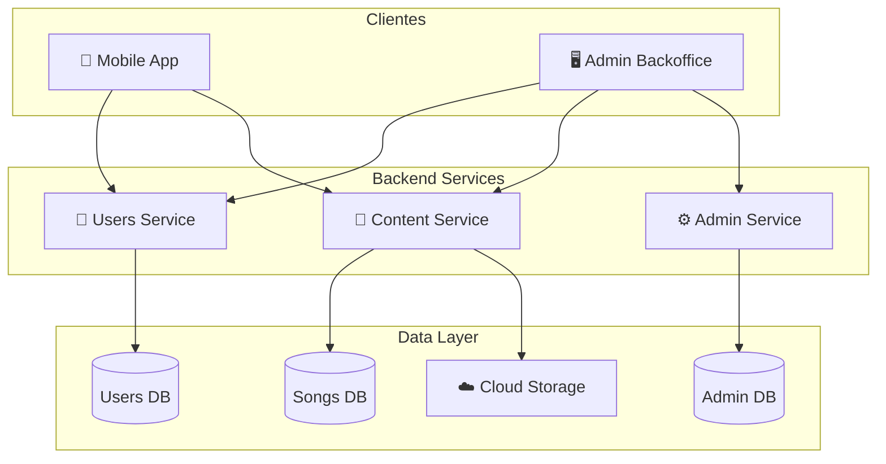
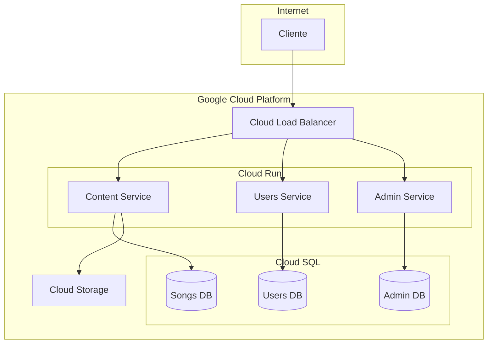
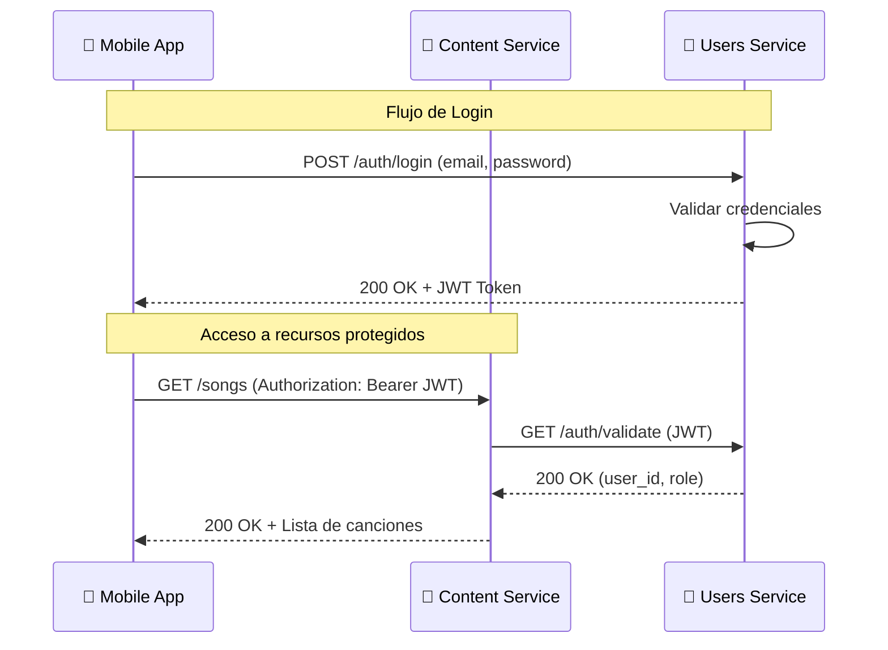
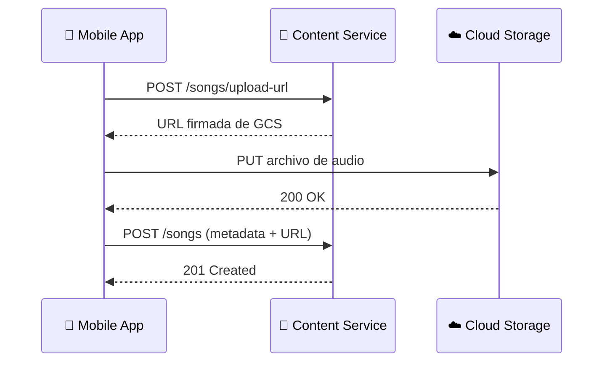
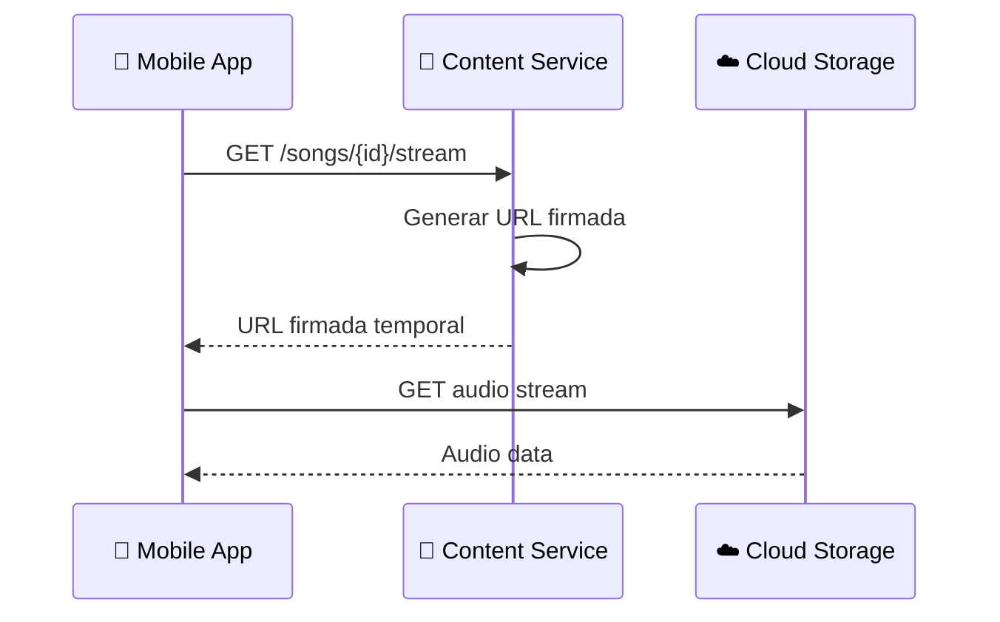

# 🏗️ Arquitectura e Infraestructura

Esta sección describe la arquitectura general de Melodia, incluyendo la infraestructura en Google Cloud Platform y los patrones de comunicación entre servicios.

---

## Visión General del Sistema

La arquitectura de Melodia sigue un patrón de **microservicios**, donde cada servicio tiene una responsabilidad única y bien definida. Los servicios se comunican entre sí principalmente a través de APIs REST.

### Principios de Diseño

- **Separación de responsabilidades**: Cada microservicio maneja un dominio específico
- **Base de datos por servicio**: Cada servicio gestiona su propia base de datos
- **Comunicación síncrona**: Las llamadas entre servicios son principalmente REST
- **Autenticación centralizada**: JWT tokens generados por Users Service y validados por los demás servicios

---

## Infraestructura en Google Cloud Platform

<!-- TODO: Agregar diagrama de infraestructura GCP con iconos oficiales -->

### Cloud Run

Todos los microservicios de Melodia se despliegan en **Cloud Run**, aprovechando su capacidad de escalado automático y modelo serverless.

| Servicio        | Imagen                         | Recursos          | Escalado        |
| --------------- | ------------------------------ | ----------------- | --------------- |
| Content Service | `gcr.io/melodia/songs-service` | 1 vCPU, 512MB RAM | 0-10 instancias |
| Users Service   | `gcr.io/melodia/users-service` | 1 vCPU, 256MB RAM | 0-10 instancias |
| Admin Service   | `gcr.io/melodia/admin-service` | 1 vCPU, 256MB RAM | 0-5 instancias  |

<!-- TODO: Completar con configuraciones reales de Cloud Run -->

### Cloud SQL (PostgreSQL)

Cada microservicio tiene su propia base de datos PostgreSQL en Cloud SQL.

| Base de Datos      | Servicio        | Tier        | Almacenamiento |
| ------------------ | --------------- | ----------- | -------------- |
| `melodia-songs-db` | Content Service | db-f1-micro | 10 GB SSD      |
| `melodia-users-db` | Users Service   | db-f1-micro | 10 GB SSD      |
| `melodia-admin-db` | Admin Service   | db-f1-micro | 10 GB SSD      |

<!-- TODO: Actualizar con configuraciones reales -->

### Cloud Storage

Cloud Storage se utiliza para almacenar archivos multimedia:

- **Bucket de canciones**: `melodia-songs-bucket` - Archivos de audio (.mp3, .wav)
- **Bucket de imágenes**: `melodia-images-bucket` - Portadas de álbumes, fotos de perfil

<!-- TODO: Agregar detalles de configuración de buckets -->

### Diagrama de Infraestructura GCP

<!-- TODO: Agregar diagrama más detallado con VPC, networking, etc. -->

---

## Comunicación entre Servicios

### Flujo de Autenticación

### Flujo de Subida de Canción

### Flujo de Streaming

<!-- TODO: Agregar más diagramas de flujo según sea necesario -->
