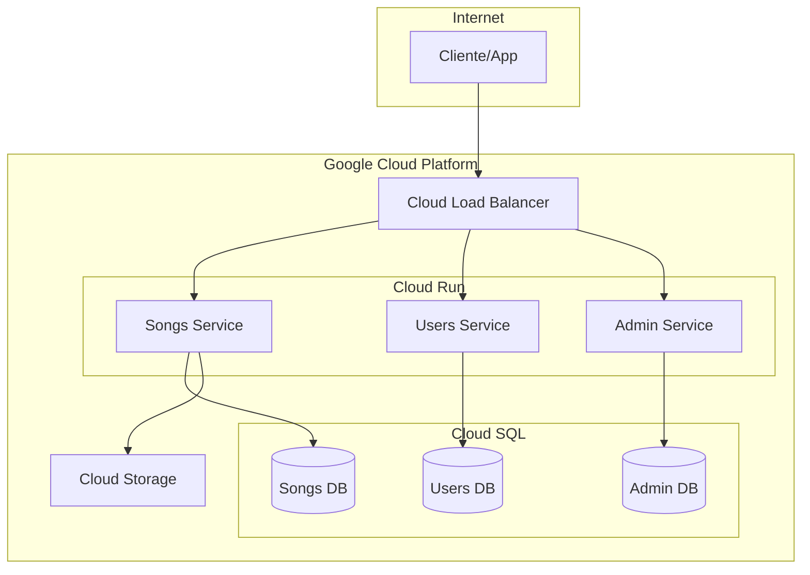
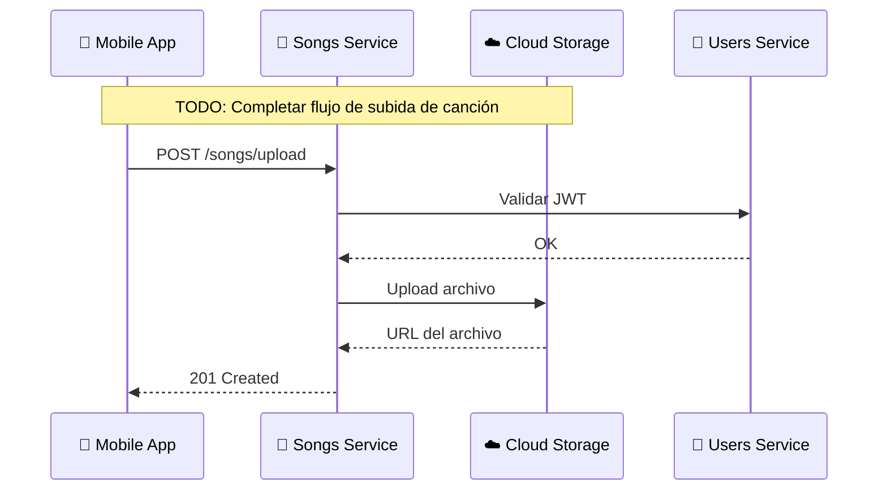
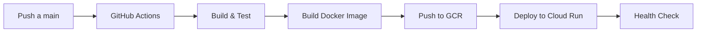

# 🏗️ Arquitectura

Esta sección describe la arquitectura general de Melodia, incluyendo la infraestructura en Google Cloud Platform, los patrones de comunicación entre servicios, y el pipeline de CI/CD.

---

## Visión General

<!-- TODO: Agregar diagrama de arquitectura general creado en draw.io con iconos de GCP -->

!!! info "Sobre el diagrama"
    El diagrama de arquitectura será creado usando draw.io con los iconos oficiales de Google Cloud Platform para representar cada componente de infraestructura.

La arquitectura de Melodia sigue un patrón de microservicios, donde cada servicio tiene una responsabilidad única y bien definida. Los servicios se comunican entre sí principalmente a través de APIs REST.

### Principios de Diseño

- **Separación de responsabilidades**: Cada microservicio maneja un dominio específico
- **Base de datos por servicio**: Cada servicio gestiona su propia base de datos
- **Comunicación síncrona**: Las llamadas entre servicios son principalmente REST
- **Autenticación centralizada**: JWT tokens validados por el Users Service

---

## Infraestructura en Google Cloud Platform

### Cloud Run

Todos los microservicios de Melodia se despliegan en **Cloud Run**, aprovechando su capacidad de escalado automático y modelo serverless.

| Servicio | Imagen | Recursos | Escalado |
|----------|--------|----------|----------|
| Songs Service | `gcr.io/melodia/songs-service` | 1 vCPU, 512MB RAM | 0-10 instancias |
| Users Service | `gcr.io/melodia/users-service` | 1 vCPU, 256MB RAM | 0-10 instancias |
| Admin Service | `gcr.io/melodia/admin-service` | 1 vCPU, 256MB RAM | 0-5 instancias |

<!-- TODO: Completar con configuraciones reales de Cloud Run -->

!!! tip "Configuración de escalado"
    El escalado a cero (scale-to-zero) está habilitado para optimizar costos en ambiente de desarrollo. En producción, se mantiene al menos una instancia activa para reducir latencia de cold starts.

### Cloud SQL (PostgreSQL)

Cada microservicio tiene su propia base de datos PostgreSQL en Cloud SQL.

| Base de Datos | Servicio | Tier | Almacenamiento |
|---------------|----------|------|----------------|
| `melodia-songs-db` | Songs Service | db-f1-micro | 10 GB SSD |
| `melodia-users-db` | Users Service | db-f1-micro | 10 GB SSD |
| `melodia-admin-db` | Admin Service | db-f1-micro | 10 GB SSD |

<!-- TODO: Actualizar con configuraciones reales de las bases de datos -->

### Cloud Storage

Cloud Storage se utiliza para almacenar archivos multimedia:

- **Bucket de canciones**: `melodia-songs-bucket`
    - Archivos de audio (.mp3, .wav)
    - Almacenamiento regional (us-central1)
    - Acceso público para streaming

- **Bucket de imágenes**: `melodia-images-bucket`
    - Portadas de álbumes
    - Fotos de perfil
    - Thumbnails generados automáticamente

<!-- TODO: Agregar detalles de configuración de buckets y políticas de acceso -->

### Networking y Seguridad

<!-- TODO: Completar diagrama con VPC, Cloud Armor, y configuraciones de seguridad -->

!!! warning "Seguridad"
    - Todas las conexiones a Cloud SQL usan Cloud SQL Proxy
    - Los servicios se comunican a través de la red interna de GCP
    - CORS configurado para dominios específicos
    - Rate limiting implementado en Cloud Armor

---

## Comunicación entre Servicios

### Flujo de Autenticación

<!-- TODO: Agregar más flujos de secuencia (registro, subida de canción, etc.) -->

### Flujo de Subida de Canción

---

## CI/CD Pipeline

El pipeline de CI/CD está implementado usando GitHub Actions y despliega automáticamente a Cloud Run.

### Flujo de Deployment

### Etapas del Pipeline

1. **Trigger**: Push a la rama `main` o merge de PR
2. **Build & Test**: 
    - Instalación de dependencias
    - Ejecución de linters
    - Ejecución de tests unitarios
    - Ejecución de tests de integración
3. **Build Docker Image**: Construcción de imagen usando Dockerfile
4. **Push to GCR**: Subida de imagen a Google Container Registry
5. **Deploy to Cloud Run**: Despliegue de nueva revisión
6. **Health Check**: Verificación de que el servicio está respondiendo

<!-- TODO: Agregar ejemplos de archivos de workflow de GitHub Actions -->

!!! note "Ambientes"
    Actualmente se utiliza un único ambiente (producción). En futuras iteraciones se planea agregar ambiente de staging.
