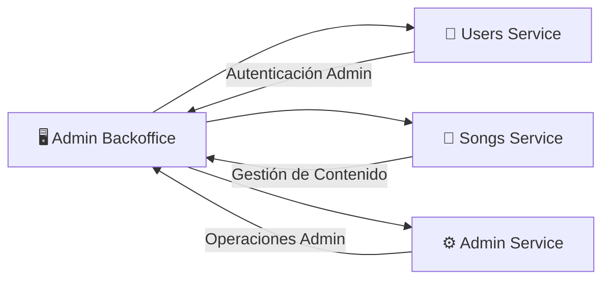

# 🖥️ Admin Backoffice

El Admin Backoffice es el panel de administración web de Melodia, utilizado por el equipo de operaciones para gestionar usuarios, contenido y configuraciones del sistema.

---

## Overview

El Admin Backoffice es una aplicación web desarrollada en Next.js que permite a los administradores:

- **Gestión de usuarios**: Ver, bloquear/desbloquear, editar usuarios
- **Gestión de contenido**: Moderar canciones, álbumes, playlists
- **Métricas**: Visualizar estadísticas del sistema
- **Configuración**: Ajustar parámetros del sistema

<!-- TODO: Agregar descripción más detallada del alcance del backoffice -->

**Repositorio**: [Melodia-FIUBA/admin-backoffice](https://github.com/Melodia-FIUBA/admin-backoffice)

---

## Stack Tecnológico

| Categoría | Tecnología | Versión |
|-----------|------------|---------|
| Framework | Next.js | <!-- TODO --> 14.x |
| Lenguaje | TypeScript | <!-- TODO --> 5.x |
| UI Components | shadcn/ui | <!-- TODO --> - |
| Estilos | Tailwind CSS | <!-- TODO --> 3.x |
| Estado | React Query | <!-- TODO --> 5.x |
| HTTP Client | Axios | <!-- TODO --> 1.x |
| Autenticación | NextAuth.js | <!-- TODO --> 4.x |
| Charts | Recharts | <!-- TODO --> 2.x |
| Testing | Jest + React Testing Library | <!-- TODO --> - |

<!-- TODO: Actualizar versiones reales -->

---

## Arquitectura de Componentes

<!-- TODO: Agregar diagrama de componentes/páginas creado en draw.io -->


### Estructura del Proyecto

```
src/
├── app/              # App Router de Next.js
│   ├── (auth)/      # Rutas de autenticación
│   ├── (dashboard)/ # Rutas del dashboard
│   └── api/         # API Routes
├── components/       # Componentes reutilizables
│   ├── ui/          # Componentes de UI base
│   └── features/    # Componentes de features
├── lib/             # Utilidades y configuraciones
├── hooks/           # Custom hooks
├── services/        # Servicios de API
├── types/           # Tipos TypeScript
└── styles/          # Estilos globales
```

<!-- TODO: Actualizar con estructura real del proyecto -->

---

## Conexiones con Otros Servicios



### APIs Consumidas

| Servicio | Funcionalidad | Endpoints Principales |
|----------|---------------|----------------------|
| Users Service | Autenticación admin | `/auth/*`, `/admin/users/*` |
| Songs Service | Gestión de contenido | `/songs/*`, `/admin/songs/*` |
| Admin Service | Operaciones administrativas | `/admin/*` |

---

## Decisiones de Implementación

### 1. Next.js App Router

<!-- TODO: Completar con justificación real -->

**Decisión**: Se eligió Next.js con App Router sobre Pages Router.

**Razón**: *Pendiente de completar*

**Consecuencias**:

- Server Components por defecto
- Mejor performance con streaming
- *Pendiente de completar*

---

### 2. shadcn/ui para Componentes

<!-- TODO: Completar con justificación real -->

**Decisión**: Usar shadcn/ui como sistema de componentes.

**Razón**: *Pendiente de completar*

**Alternativas consideradas**: Material UI, Chakra UI, Ant Design

---

### 3. React Query para Data Fetching

<!-- TODO: Completar con justificación real -->

**Decisión**: Usar React Query para manejo de estado del servidor.

**Razón**: *Pendiente de completar*

---

### 4. Estrategia de Autenticación Admin

<!-- TODO: Completar con implementación real -->

**Decisión**: *Pendiente de completar*

**Implementación**:

- Roles de admin verificados en el servidor
- *Pendiente de completar*

---

## Aprendizajes

### 1. Server Components vs Client Components

<!-- TODO: Completar con aprendizaje real -->

**Problema**: *Pendiente de completar*

**Solución**: *Pendiente de completar*

**Aprendizaje**: *Pendiente de completar*

---

### 2. Manejo de Sesiones Admin

<!-- TODO: Completar con aprendizaje real -->

**Problema**: *Pendiente de completar*

**Solución**: *Pendiente de completar*

**Aprendizaje**: *Pendiente de completar*

---

### 3. Optimización de Tablas con Muchos Datos

<!-- TODO: Completar con aprendizaje real -->

**Problema**: *Pendiente de completar*

**Solución**: *Pendiente de completar*

**Aprendizaje**: *Pendiente de completar*

---

## Setup Local

### Requisitos

- Node.js 18+
- npm o yarn

### Instalación

```bash
# Clonar repositorio
git clone https://github.com/Melodia-FIUBA/admin-backoffice.git
cd admin-backoffice

# Instalar dependencias
npm install

# Configurar variables de entorno
cp .env.example .env.local
# Editar .env.local con valores correctos
```

### Ejecutar

```bash
# Modo desarrollo
npm run dev

# Build de producción
npm run build

# Ejecutar build
npm start
```

<!-- TODO: Actualizar comandos según configuración real del proyecto -->

### Variables de Entorno

```bash
# .env.example
NEXT_PUBLIC_API_URL=https://api.melodia.com
NEXTAUTH_URL=http://localhost:3000
NEXTAUTH_SECRET=your-secret-key
USERS_SERVICE_URL=https://users-service-xxxxx.run.app
SONGS_SERVICE_URL=https://songs-service-xxxxx.run.app
ADMIN_SERVICE_URL=https://admin-service-xxxxx.run.app
```

<!-- TODO: Agregar todas las variables de entorno necesarias -->

---

## Testing

```bash
# Ejecutar tests unitarios
npm test

# Ejecutar tests con coverage
npm run test:coverage

# Ejecutar tests e2e
npm run test:e2e
```

<!-- TODO: Actualizar comandos según configuración real -->

!!! tip "Coverage mínimo"
    El proyecto requiere un mínimo de <!-- TODO --> X% de coverage para pasar CI.
