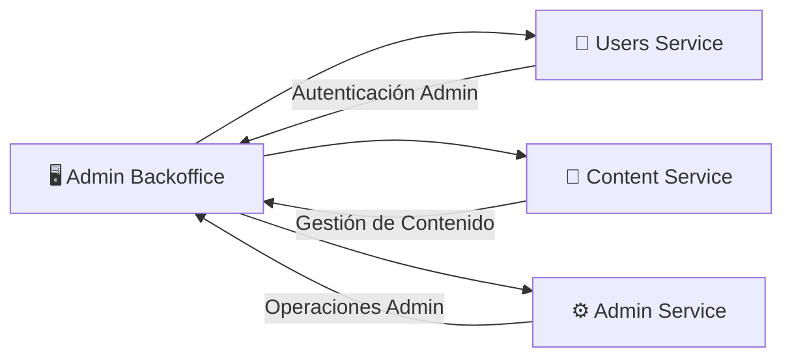

# 🖥️ Admin Backoffice

**Repositorio**: [Melodia-FIUBA/admin-backoffice](https://github.com/Melodia-FIUBA/admin-backoffice)

El Admin Backoffice es el panel de administración web de Melodia, utilizado por el equipo de operaciones para gestionar usuarios, contenido y configuraciones del sistema.

---

## Diagrama de Arquitectura



<!-- TODO: Agregar diagrama más detallado de arquitectura interna -->

---

## Tech Stack

| Categoría     | Tecnología                   | Versión            |
| ------------- | ---------------------------- | ------------------ |
| Framework     | Next.js                      | <!-- TODO --> 14.x |
| Lenguaje      | TypeScript                   | <!-- TODO --> 5.x  |
| UI Components | shadcn/ui                    | <!-- TODO --> -    |
| Estilos       | Tailwind CSS                 | <!-- TODO --> 3.x  |
| Estado        | React Query                  | <!-- TODO --> 5.x  |
| HTTP Client   | Axios                        | <!-- TODO --> 1.x  |
| Autenticación | NextAuth.js                  | <!-- TODO --> 4.x  |
| Charts        | Recharts                     | <!-- TODO --> 2.x  |
| Testing       | Jest + React Testing Library | <!-- TODO --> -    |

<!-- TODO: Actualizar versiones reales -->

---

## Decisiones Clave y Features Destacadas

### 1. Next.js App Router

<!-- TODO: Completar con justificación real -->

**Decisión**: Se eligió Next.js con App Router sobre Pages Router.

**Razón**: _Pendiente de completar_

### 2. shadcn/ui para Componentes

<!-- TODO: Completar con justificación real -->

**Decisión**: Usar shadcn/ui como sistema de componentes.

**Razón**: _Pendiente de completar_

**Alternativas consideradas**: Material UI, Chakra UI, Ant Design

### 3. React Query para Data Fetching

**Decisión**: Usar React Query para manejo de estado del servidor.

**Justificación**: Manejo automático de cache, refetch y estados de carga.

---

## DevOps, CI/CD y Testing

### Setup Local

**Requisitos:**

- Node.js 18+
- npm o yarn

**Instalación:**

```bash
# Clonar repositorio
git clone https://github.com/Melodia-FIUBA/admin-backoffice.git
cd admin-backoffice

# Instalar dependencias
npm install

# Configurar variables de entorno
cp .env.example .env.local
```

**Ejecutar:**

```bash
# Modo desarrollo
npm run dev

# Build de producción
npm run build
npm start
```

### Testing

```bash
# Ejecutar tests unitarios
npm test

# Ejecutar tests con coverage
npm run test:coverage
```

### CI/CD

<!-- TODO: Describir pipeline de CI/CD -->

_Pendiente de completar_
