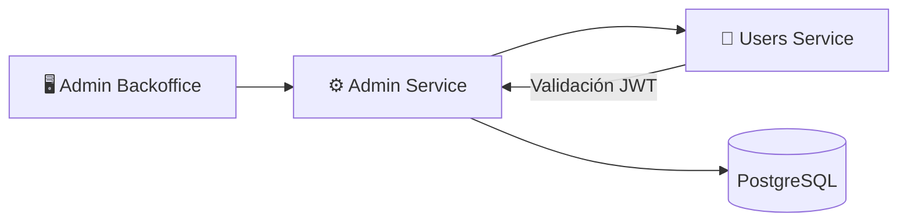

# ⚙️ Admin Service

**Repositorio**: [Melodia-FIUBA/admin-service](https://github.com/Melodia-FIUBA/admin-service)

El Admin Service es el microservicio encargado de las operaciones administrativas en Melodia.

---

## Diagrama de Arquitectura



<!-- TODO: Agregar diagrama más detallado de arquitectura interna -->

---

## Tech Stack

| Categoría         | Tecnología              | Versión            |
| ----------------- | ----------------------- | ------------------ |
| Lenguaje          | Go                      | <!-- TODO --> 1.21 |
| Framework HTTP    | Gin                     | <!-- TODO --> 1.x  |
| ORM               | GORM                    | <!-- TODO --> 1.x  |
| Base de datos     | PostgreSQL              | <!-- TODO --> 15   |
| Validación        | go-playground/validator | <!-- TODO --> 10.x |
| Testing           | testify                 | <!-- TODO --> 1.x  |
| Documentación API | Swaggo                  | <!-- TODO --> -    |

<!-- TODO: Actualizar versiones reales -->

---

## Endpoints

<!-- TODO: Agregar archivo OpenAPI en docs/openapi/admin-service.yaml y descomentar -->
<!--
```swagger-ui
openapi/admin-service.yaml
```
-->

| Método | Endpoint                    | Descripción              | Auth  |
| ------ | --------------------------- | ------------------------ | ----- |
| GET    | `/admin/users`              | Listar usuarios          | Admin |
| PUT    | `/admin/users/{id}/block`   | Bloquear usuario         | Admin |
| PUT    | `/admin/users/{id}/unblock` | Desbloquear usuario      | Admin |
| PUT    | `/admin/users/{id}/role`    | Cambiar rol              | Admin |
| GET    | `/admin/songs`              | Listar canciones         | Admin |
| PUT    | `/admin/songs/{id}/block`   | Bloquear canción         | Admin |
| GET    | `/admin/stats`              | Estadísticas del sistema | Admin |

<!-- TODO: Completar con todos los endpoints disponibles -->

---

## Decisiones Clave y Features Destacadas

### 1. Go para Consistencia

<!-- TODO: Completar con justificación real -->

**Decisión**: Usar Go para mantener consistencia con Users Service.

**Razón**: _Pendiente de completar_

### 2. Audit Logging

**Decisión**: Registrar todas las acciones administrativas en logs de auditoría.

**Justificación**: Trazabilidad y cumplimiento de políticas.

---

## DevOps, CI/CD y Testing

### Setup Local

**Requisitos:**

- Go 1.21+
- Docker y Docker Compose

**Instalación:**

```bash
# Clonar repositorio
git clone https://github.com/Melodia-FIUBA/admin-service.git
cd admin-service

# Instalar dependencias
go mod download

# Configurar variables de entorno
cp .env.example .env
```

**Ejecutar con Docker:**

```bash
docker-compose up -d
docker-compose exec app ./migrate up
```

### Testing

```bash
# Ejecutar todos los tests
go test ./...

# Con coverage
go test ./... -cover -coverprofile=coverage.out
```

### CI/CD

<!-- TODO: Describir pipeline de CI/CD -->

_Pendiente de completar_

---

## Testing

```bash
# Ejecutar todos los tests
go test ./...

# Ejecutar con coverage
go test ./... -cover -coverprofile=coverage.out

# Ver reporte de coverage
go tool cover -html=coverage.out

# Ejecutar tests específicos
go test ./internal/services/... -v
```

<!-- TODO: Actualizar comandos según configuración real -->

!!! tip "Tests de Integración"
Los tests de integración requieren que los servicios de Users y Songs estén disponibles (o mockeados).
