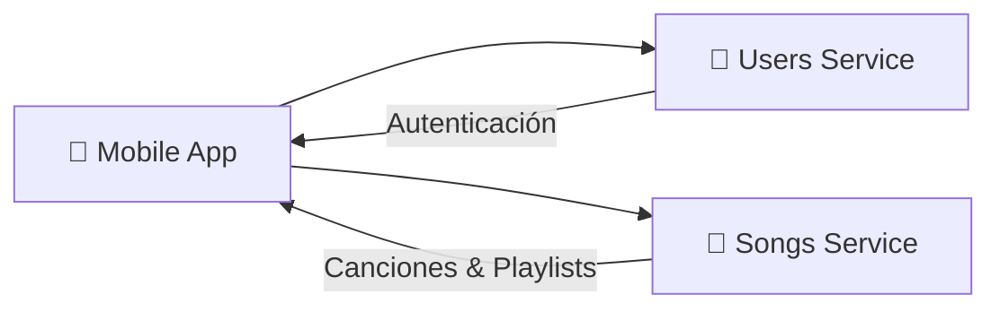

# 📱 Mobile App

La aplicación móvil de Melodia es el cliente principal para usuarios finales, tanto oyentes como artistas.

---

## Overview

La Mobile App es una aplicación desarrollada en React Native que permite a los usuarios:

- **Oyentes**: Descubrir música, crear playlists, seguir artistas, escuchar canciones
- **Artistas**: Subir música, gestionar su perfil, ver estadísticas de reproducciones

<!-- TODO: Agregar descripción más detallada del alcance de la app -->

**Repositorio**: [Melodia-FIUBA/mobile-app](https://github.com/Melodia-FIUBA/mobile-app)

---

## Stack Tecnológico

| Categoría | Tecnología | Versión |
|-----------|------------|---------|
| Framework | React Native | <!-- TODO --> 0.72.x |
| Lenguaje | TypeScript | <!-- TODO --> 5.x |
| Navegación | React Navigation | <!-- TODO --> 6.x |
| Estado | Redux Toolkit | <!-- TODO --> 2.x |
| HTTP Client | Axios | <!-- TODO --> 1.x |
| Reproductor | react-native-track-player | <!-- TODO --> 3.x |
| Notificaciones | Firebase Cloud Messaging | <!-- TODO --> - |
| Testing | Jest + React Native Testing Library | <!-- TODO --> - |

<!-- TODO: Actualizar versiones reales -->

---

## Arquitectura de Componentes

<!-- TODO: Agregar diagrama de componentes/pantallas creado en draw.io -->


### Estructura del Proyecto

```
src/
├── components/       # Componentes reutilizables
├── screens/         # Pantallas de la app
├── navigation/      # Configuración de navegación
├── store/           # Redux store y slices
├── services/        # Servicios de API
├── hooks/           # Custom hooks
├── utils/           # Utilidades y helpers
├── types/           # Tipos TypeScript
└── assets/          # Recursos estáticos
```

<!-- TODO: Actualizar con estructura real del proyecto -->

---

## Conexiones con Otros Servicios



### APIs Consumidas

| Servicio | Funcionalidad | Endpoints Principales |
|----------|---------------|----------------------|
| Users Service | Autenticación, perfiles | `/auth/*`, `/users/*` |
| Songs Service | Música, playlists, favoritos | `/songs/*`, `/playlists/*`, `/artists/*` |

---

## Decisiones de Implementación

### 1. React Native vs Flutter

<!-- TODO: Completar con justificación real -->

**Decisión**: Se eligió React Native sobre Flutter.

**Razón**: *Pendiente de completar*

**Consecuencias**:

- *Pendiente de completar*

---

### 2. Manejo de Estado con Redux Toolkit

<!-- TODO: Completar con justificación real -->

**Decisión**: Usar Redux Toolkit para estado global.

**Razón**: *Pendiente de completar*

**Alternativas consideradas**: Context API, MobX, Zustand

---

### 3. Estrategia de Caché de Audio

<!-- TODO: Completar con implementación real -->

**Decisión**: *Pendiente de completar*

**Implementación**:

- *Pendiente de completar*

---

### 4. Manejo de Imágenes y Assets

<!-- TODO: Completar con estrategia real -->

**Decisión**: *Pendiente de completar*

---

## Aprendizajes

### 1. Performance en Listas Largas

<!-- TODO: Completar con aprendizaje real -->

**Problema**: *Pendiente de completar*

**Solución**: *Pendiente de completar*

**Aprendizaje**: *Pendiente de completar*

---

### 2. Manejo de Estado de Reproducción

<!-- TODO: Completar con aprendizaje real -->

**Problema**: *Pendiente de completar*

**Solución**: *Pendiente de completar*

**Aprendizaje**: *Pendiente de completar*

---

### 3. Autenticación y Refresh Tokens

<!-- TODO: Completar con aprendizaje real -->

**Problema**: *Pendiente de completar*

**Solución**: *Pendiente de completar*

**Aprendizaje**: *Pendiente de completar*

---

## Setup Local

### Requisitos

- Node.js 18+
- npm o yarn
- React Native CLI
- Android Studio (para Android)
- Xcode (para iOS, solo macOS)

### Instalación

```bash
# Clonar repositorio
git clone https://github.com/Melodia-FIUBA/mobile-app.git
cd mobile-app

# Instalar dependencias
npm install

# iOS: instalar pods
cd ios && pod install && cd ..

# Configurar variables de entorno
cp .env.example .env
# Editar .env con valores correctos
```

### Ejecutar

```bash
# Android
npm run android

# iOS
npm run ios
```

<!-- TODO: Actualizar comandos según configuración real del proyecto -->

### Variables de Entorno

```bash
# .env.example
API_BASE_URL=https://api.melodia.com
USERS_SERVICE_URL=https://users-service-xxxxx.run.app
SONGS_SERVICE_URL=https://songs-service-xxxxx.run.app
```

<!-- TODO: Agregar todas las variables de entorno necesarias -->

---

## Testing

```bash
# Ejecutar tests unitarios
npm test

# Ejecutar tests con coverage
npm run test:coverage

# Ejecutar tests e2e
npm run test:e2e
```

<!-- TODO: Actualizar comandos según configuración real -->

!!! tip "Coverage mínimo"
    El proyecto requiere un mínimo de <!-- TODO --> X% de coverage para pasar CI.
