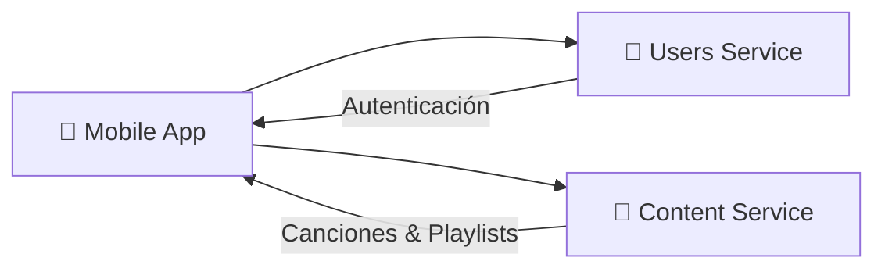

# 📱 Mobile App

**Repositorio**: [Melodia-FIUBA/mobile-app](https://github.com/Melodia-FIUBA/mobile-app)

La aplicación móvil de Melodia es el cliente principal para usuarios finales, tanto oyentes como artistas.

---

## Diagrama de Arquitectura



<!-- TODO: Agregar diagrama más detallado de arquitectura interna -->

---

## Tech Stack

| Categoría      | Tecnología                          | Versión              |
| -------------- | ----------------------------------- | -------------------- |
| Framework      | React Native                        | <!-- TODO --> 0.72.x |
| Lenguaje       | TypeScript                          | <!-- TODO --> 5.x    |
| Navegación     | React Navigation                    | <!-- TODO --> 6.x    |
| Estado         | Redux Toolkit                       | <!-- TODO --> 2.x    |
| HTTP Client    | Axios                               | <!-- TODO --> 1.x    |
| Reproductor    | react-native-track-player           | <!-- TODO --> 3.x    |
| Notificaciones | Firebase Cloud Messaging            | <!-- TODO --> -      |
| Testing        | Jest + React Native Testing Library | <!-- TODO --> -      |

<!-- TODO: Actualizar versiones reales -->

---

## Decisiones Clave y Features Destacadas

### 1. React Native vs Flutter

<!-- TODO: Completar con justificación real -->

**Decisión**: Se eligió React Native sobre Flutter.

**Razón**: _Pendiente de completar_

### 2. Manejo de Estado con Redux Toolkit

<!-- TODO: Completar con justificación real -->

**Decisión**: Usar Redux Toolkit para estado global.

**Razón**: _Pendiente de completar_

**Alternativas consideradas**: Context API, MobX, Zustand

### 3. Estrategia de Reproducción de Audio

<!-- TODO: Completar con implementación real -->

**Decisión**: _Pendiente de completar_

---

## DevOps, CI/CD y Testing

### Setup Local

**Requisitos:**

- Node.js 18+
- npm o yarn
- React Native CLI
- Android Studio (para Android)
- Xcode (para iOS, solo macOS)

**Instalación:**

```bash
# Clonar repositorio
git clone https://github.com/Melodia-FIUBA/mobile-app.git
cd mobile-app

# Instalar dependencias
npm install

# iOS: instalar pods
cd ios && pod install && cd ..

# Configurar variables de entorno
cp .env.example .env
```

**Ejecutar:**

```bash
# Android
npm run android

# iOS
npm run ios
```

### Testing

```bash
# Ejecutar tests unitarios
npm test

# Ejecutar tests con coverage
npm run test:coverage
```

### CI/CD

<!-- TODO: Describir pipeline de CI/CD -->

_Pendiente de completar_
