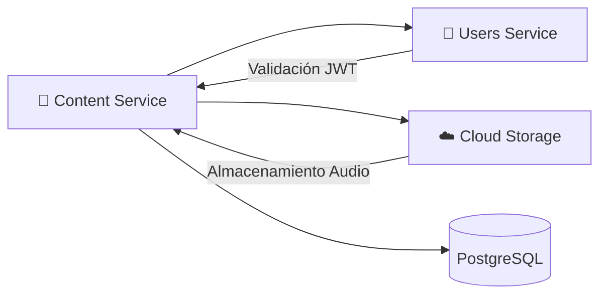

# 🎵 Content Service

**Repositorio**: [Melodia-FIUBA/songs-service](https://github.com/Melodia-FIUBA/songs-service)

El Content Service es el microservicio encargado de gestionar toda la lógica relacionada con canciones, álbumes, playlists y colecciones en Melodia.

---

## Diagrama de Arquitectura



<!-- TODO: Agregar diagrama más detallado de arquitectura interna -->

---

## Tech Stack

| Categoría         | Tecnología            | Versión            |
| ----------------- | --------------------- | ------------------ |
| Lenguaje          | Python                | <!-- TODO --> 3.11 |
| Framework         | Flask                 | <!-- TODO --> 3.x  |
| ORM               | SQLAlchemy            | <!-- TODO --> 2.x  |
| Migraciones       | Alembic               | <!-- TODO --> 1.x  |
| Base de datos     | PostgreSQL            | <!-- TODO --> 15   |
| Storage           | Google Cloud Storage  | <!-- TODO --> -    |
| Validación        | Marshmallow           | <!-- TODO --> 3.x  |
| Testing           | pytest                | <!-- TODO --> 7.x  |
| Documentación API | Flask-RESTX / OpenAPI | <!-- TODO --> -    |

<!-- TODO: Actualizar versiones reales -->

---

## Endpoints

<!-- TODO: Agregar archivo OpenAPI en docs/openapi/songs-service.yaml y descomentar -->
<!--
```swagger-ui
openapi/songs-service.yaml
```
-->

| Método | Endpoint             | Descripción                  | Auth                |
| ------ | -------------------- | ---------------------------- | ------------------- |
| GET    | `/songs`             | Listar canciones             | Opcional            |
| POST   | `/songs`             | Crear canción                | Requerido (Artista) |
| GET    | `/songs/{id}`        | Obtener canción              | Opcional            |
| PUT    | `/songs/{id}`        | Actualizar canción           | Requerido (Owner)   |
| DELETE | `/songs/{id}`        | Eliminar canción             | Requerido (Owner)   |
| GET    | `/songs/{id}/stream` | URL de streaming             | Requerido           |
| GET    | `/albums`            | Listar álbumes               | Opcional            |
| POST   | `/albums`            | Crear álbum                  | Requerido (Artista) |
| GET    | `/playlists`         | Listar playlists del usuario | Requerido           |
| POST   | `/playlists`         | Crear playlist               | Requerido           |
| GET    | `/search`            | Búsqueda de canciones        | Opcional            |

<!-- TODO: Completar con todos los endpoints disponibles -->

---

## Decisiones Clave y Features Destacadas

### 1. Arquitectura en Capas

<!-- TODO: Completar con justificación real -->

**Decisión**: Usar arquitectura en capas (Routes → Services → Models).

**Razón**: _Pendiente de completar_

### 2. URLs Firmadas para Streaming

**Decisión**: Usar URLs firmadas de GCS para streaming de audio.

**Justificación**: Permite control de acceso temporal y evita exponer URLs permanentes de los archivos.

### 3. Alembic para Migraciones

**Decisión**: Usar Alembic para gestión de migraciones de base de datos.

**Razón**: _Pendiente de completar_

---

## DevOps, CI/CD y Testing

### Setup Local

**Requisitos:**

- Python 3.11+
- Docker y Docker Compose
- Google Cloud SDK (opcional)

**Instalación:**

```bash
# Clonar repositorio
git clone https://github.com/Melodia-FIUBA/songs-service.git
cd songs-service

# Crear entorno virtual
python -m venv venv
source venv/bin/activate  # Linux/Mac
# venv\Scripts\activate  # Windows

# Instalar dependencias
pip install -r requirements.txt

# Configurar variables de entorno
cp .env.example .env
```

**Ejecutar con Docker:**

```bash
docker-compose up -d
docker-compose exec app flask db upgrade
```

### Testing

```bash
# Ejecutar todos los tests
pytest

# Con coverage
pytest --cov=app --cov-report=html
```

### CI/CD

<!-- TODO: Describir pipeline de CI/CD -->

_Pendiente de completar_
