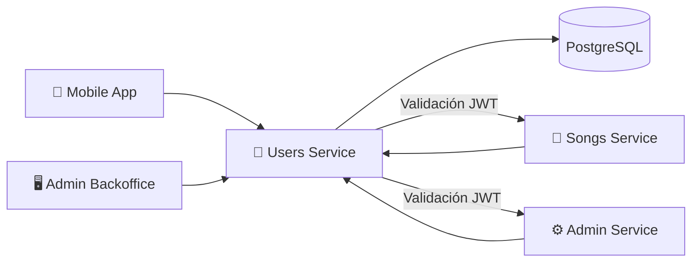

# 👤 Users Service

**Repositorio**: [Melodia-FIUBA/users-service](https://github.com/Melodia-FIUBA/users-service)

El Users Service es el microservicio encargado de la autenticación, autorización y gestión de usuarios en Melodia.

---

## Diagrama de Arquitectura



<!-- TODO: Agregar diagrama más detallado de arquitectura interna -->

---

## Tech Stack

| Categoría         | Tecnología              | Versión            |
| ----------------- | ----------------------- | ------------------ |
| Lenguaje          | Go                      | <!-- TODO --> 1.21 |
| Framework HTTP    | Gin                     | <!-- TODO --> 1.x  |
| ORM               | GORM                    | <!-- TODO --> 1.x  |
| Base de datos     | PostgreSQL              | <!-- TODO --> 15   |
| Autenticación     | JWT (golang-jwt)        | <!-- TODO --> 5.x  |
| Validación        | go-playground/validator | <!-- TODO --> 10.x |
| Testing           | testify                 | <!-- TODO --> 1.x  |
| Documentación API | Swaggo                  | <!-- TODO --> -    |

<!-- TODO: Actualizar versiones reales -->

---

## Endpoints

<!-- TODO: Agregar archivo OpenAPI en docs/openapi/users-service.yaml y descomentar -->
<!--
```swagger-ui
openapi/users-service.yaml
```
-->

| Método | Endpoint         | Descripción             | Auth      |
| ------ | ---------------- | ----------------------- | --------- |
| POST   | `/auth/register` | Registrar nuevo usuario | No        |
| POST   | `/auth/login`    | Iniciar sesión          | No        |
| POST   | `/auth/logout`   | Cerrar sesión           | Requerido |
| POST   | `/auth/refresh`  | Renovar token           | Requerido |
| GET    | `/auth/validate` | Validar token (interno) | Token     |
| GET    | `/users/me`      | Obtener perfil actual   | Requerido |
| PUT    | `/users/me`      | Actualizar perfil       | Requerido |
| GET    | `/users/{id}`    | Obtener usuario público | Opcional  |

<!-- TODO: Completar con todos los endpoints disponibles -->

---

## Decisiones Clave y Features Destacadas

### 1. Go como Lenguaje

<!-- TODO: Completar con justificación real -->

**Decisión**: Usar Go para el servicio de autenticación.

**Razón**: _Pendiente de completar_

### 2. JWT Stateless con Refresh Tokens

**Decisión**: Usar JWT tokens stateless con refresh tokens.

**Justificación**: No requiere consulta a DB en cada request, mejora escalabilidad.

**Trade-off**: Revocación de tokens más compleja.

### 3. Bcrypt para Passwords

**Decisión**: Usar bcrypt para hash de contraseñas con cost factor 12.

---

## DevOps, CI/CD y Testing

### Setup Local

**Requisitos:**

- Go 1.21+
- Docker y Docker Compose

**Instalación:**

```bash
# Clonar repositorio
git clone https://github.com/Melodia-FIUBA/users-service.git
cd users-service

# Instalar dependencias
go mod download

# Configurar variables de entorno
cp .env.example .env
```

**Ejecutar con Docker:**

```bash
docker-compose up -d
docker-compose exec app ./migrate up
```

### Testing

```bash
# Ejecutar todos los tests
go test ./...

# Con coverage
go test ./... -cover -coverprofile=coverage.out
```

### CI/CD

<!-- TODO: Describir pipeline de CI/CD -->

_Pendiente de completar_
